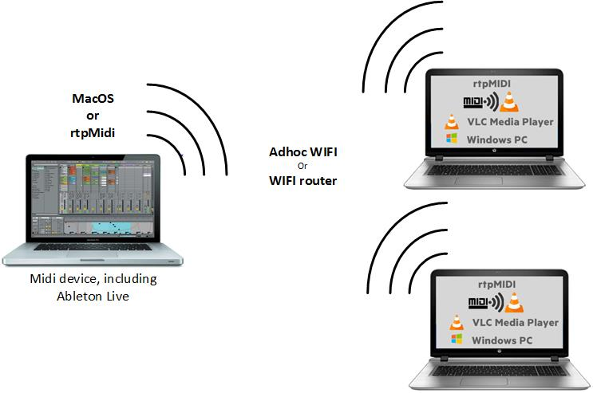

# VLC Midi Remote
VLC Midi remote is a small Windows utility to control VLC Media Player with MIDI commands.
One use case is to play items in a VLC playlist using MIDI messages.

MIDI can be wired or wireless, using the awesome [rtpMIDI project](http://www.tobias-erichsen.de/software/rtpmidi.html).

# Download

Head over to https://github.com/ojacques/VLCMidiRemote/releases

# MIDI library
I'm taking advantage of the awesome MIDI library originally 
from [Leslie SANFORD](http://www.codeproject.com/Articles/6228/C-MIDI-Toolkit) 
and now maintained by Tebjan Halm at 
[https://github.com/tebjan/Sanford.Multimedia.Midi](https://github.com/tebjan/Sanford.Multimedia.Midi) 

